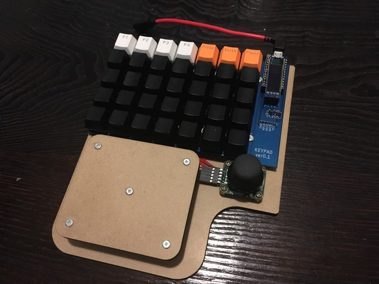
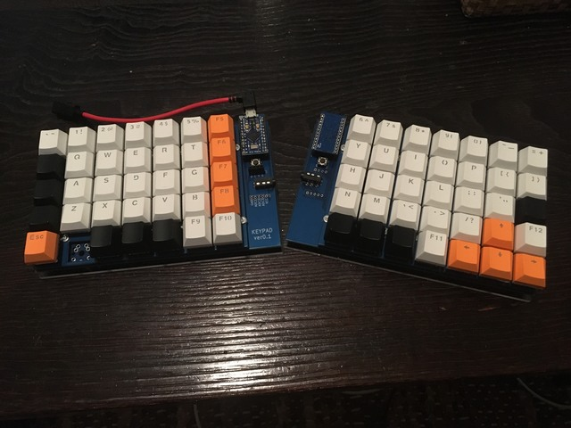

# msykbd

tkhshmsy's original keyboard which contains pcb, chassis, and firmware

## why build this?

I have been using [Logitech G13](https://support.logitech.com/en_us/product/g13-advanced-gameboard) which is very good and my favorite one.

With long use, it became not to working properly...
So, I want NEW one, but, unfortunately, G13 was already discontinued production.

I decided to make it myself.

## product

- Left-hand Gaming Keypad
  - 35 Keys
  - AnalogStick (work as keys, not pointing device)

- Separate Ortholinear Keyboard
  - US 70 keys

 
## PCB

- designed with Kicad v5

### parts

- promicro (ATMega32U4@16MHz)
- OLED (128x32 with SSD1306)
- mechanical key switches
  - cherryMX or Kailh Lowprofile
- TRRS plug
  
## Firmware

- build with platformio
  - framework : arduino

### required libraries

- ID 891
  - Keyboard
- ID 13
  - Adafruit GFX
- ID 135
  - Adafruit SSD1306

## Chassis

- designed with Fusion360
  - export DXF and convert into Adobe Illustrator
- for LaserCutter 'trotec Speedy 300'
  - worked at [FabLab Setagaya at IID](http://fablabsetagaya.com/)

## Author

- tkhshmsy@gmail.com